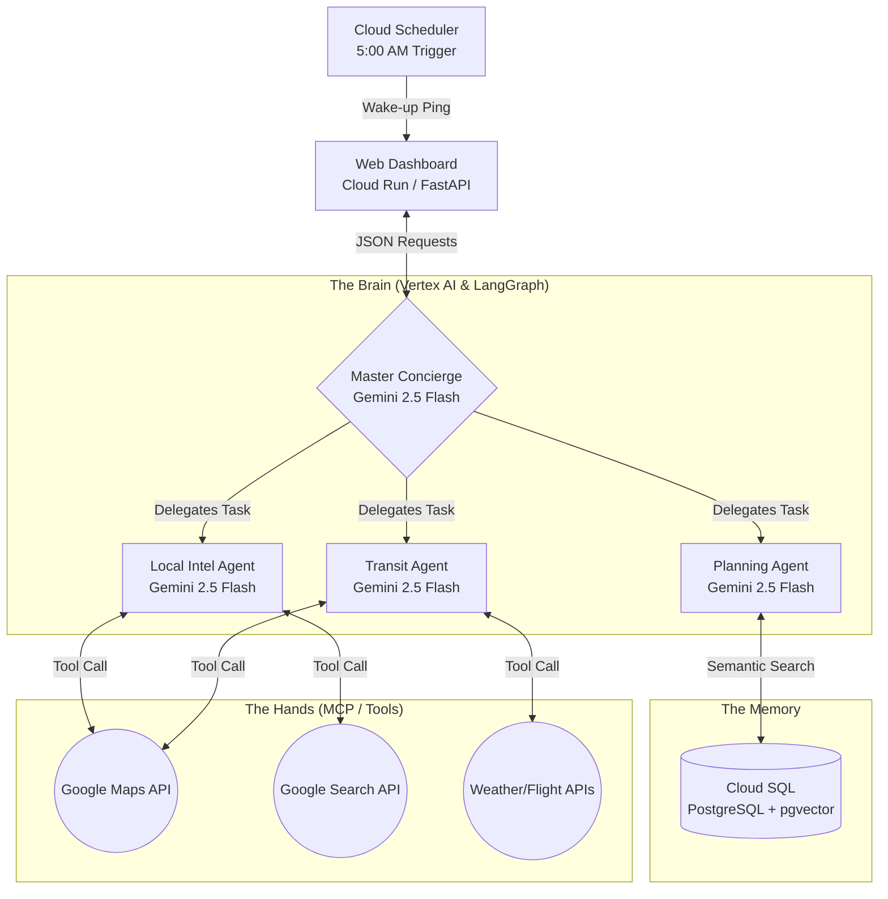

# TravellerPie 🥧
**The Hyper-Dynamic Travel & Logistics Orchestrator**

## 🌍 The Problem
Planning and executing a complex, multi-city trip or living as a digital nomad involves constantly shifting variables. A single delayed flight can ruin train connections, hotel bookings, and tour reservations, requiring hours of stressful phone calls in foreign languages. 

## 💡 The Solution
TravellerPie is an autonomous, multi-agent AI system built natively on Google Cloud. It acts as a proactive digital concierge, visualizing your trip not as a static PDF, but as a dynamic, living timeline. It monitors real-time weather, transit delays, and local intel, surgically pivoting your itinerary before a crisis occurs.

---

## 🏗️ System Architecture

Our system utilizes the **Supervisor Pattern** via LangGraph, hosted entirely within the Google Cloud ecosystem for enterprise-grade security and scalability.



## ✨ Core Features

The 5:00 AM Proactive Run: Powered by Google Cloud Scheduler, the system wakes up at 5:00 AM daily, checks real-time global APIs against the user's itinerary, makes autonomous adjustments, and generates a synthesized Morning Briefing before the user wakes up.

Deterministic Preference Engine: TravellerPie does not hallucinate recommendations. It uses pgvector in Cloud SQL to semantically match real-time indoor/outdoor activities against the user's stored onboarding preferences (e.g., swapping a park for an indoor bouldering gym if it rains, based on a fitness preference).

Multi-Agent Tool Use (MCP): Specialized Gemini 1.5 Flash sub-agents independently execute API calls to Google Maps, Custom Search, and Transit endpoints, reporting back to the Gemini 1.5 Pro Orchestrator.

## 🛠️ Tech Stack

1. **Frontend & API:** FastAPI, HTML/CSS (Tailwind CSS), deployed serverless via Google Cloud Run.

2. **AI Orchestration:** Vertex AI Reasoning Engine, LangGraph, LangChain.

3. **Core Models:** Gemini 1.5 Pro (Reasoning) and Gemini 1.5 Flash (Tool Execution).

4. **Database:** Cloud SQL for PostgreSQL (with pgvector for semantic memory).

5. **Automation:** Google Cloud Scheduler.

## 📂 Repository Structure

```
TravellerPie/
│
├── app/                  # The Body (Web UI & API)
│   ├── main.py           # FastAPI server and routing endpoints
│   └── templates/        # HTML templates and Tailwind CSS
│
├── agents/               # The Brains (AI Logic)
│   ├── orchestrator.py   # LangGraph state graph and Gemini Pro logic
│   └── sub_agents.py     # Definitions for Transit, Intel, and Planning agents
│
├── tools/                # The Hands (MCP & External APIs)
│   ├── local_intel.py    # Google Search and Weather API wrappers
│   └── maps_api.py       # Google Maps routing and places wrappers
│
├── .gitignore            # Git exclusion rules
├── Dockerfile            # Cloud Run containerization instructions
├── requirements.txt      # Python dependencies
└── README.md             # Project documentation
```

## 🚀 Local Development Setup

### 1. Prerequisites
- Python 3.11+
- Google Cloud CLI (gcloud) installed
- A Google Cloud Project with Billing Enabled

### 2. Clone and Install
```bash
git clone https://github.com/your-username/TravellerPie.git
cd TravellerPie

# Set up virtual environment
python3 -m venv venv
source venv/bin/activate  # Windows: venv\Scripts\activate

# Install dependencies
pip install -r requirements.txt
```

### 3. Google Cloud Authentication
You must authenticate your local machine to allow the Python code to interact with Vertex AI.

```bash
gcloud init
gcloud auth application-default login
```

### 4. Run the Development Server
```bash
uvicorn app.main:app --reload
```
Navigate to http://localhost:8000 to view the TravellerPie dashboard.

## 👥 The Team

Built for the Google Gen AI Academy APAC Edition Cohort 1 Hackathon.

#### Vaishnavi - AI Architecture, LangGraph Routing, Cloud SQL/pgvector

#### Rahul Selvakumar- Cloud Run Deployment, Frontend UI, Tool Integrations & MCP
